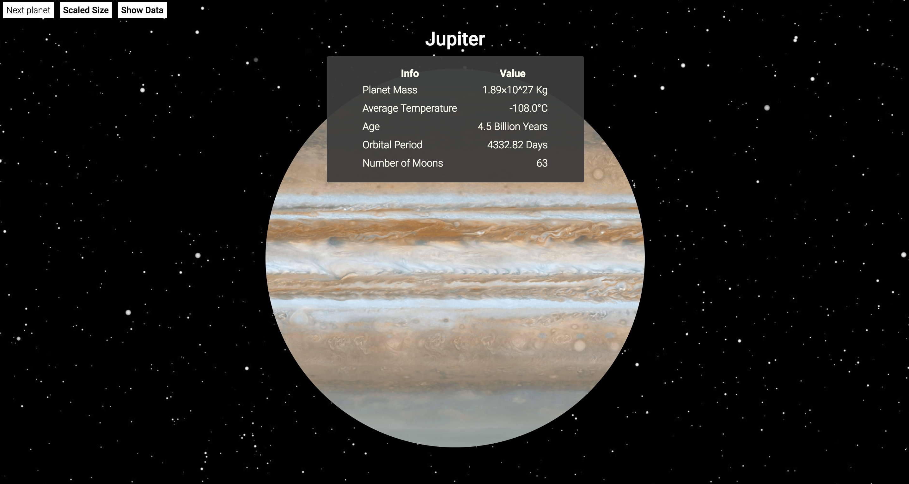
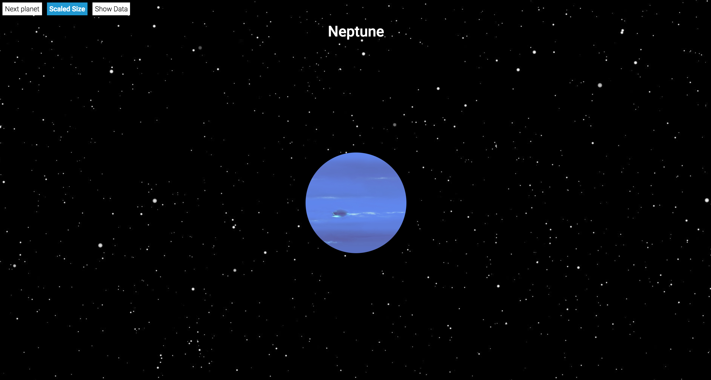

# astro-fan

A (very) simple website to browse and see some astronomic data ! Using ELM and SVG for experimental purposes !

## Functionalities
* Scaling the planets
* Get infos about each planet

## Use

### Local environement
```javascript
npm install
npm start
```

The local server will serve on `localhost:8080`.

### Production environment
```
export NODE_ENV=production
```
```javascript
npm install
npm run build
```

## Preview



